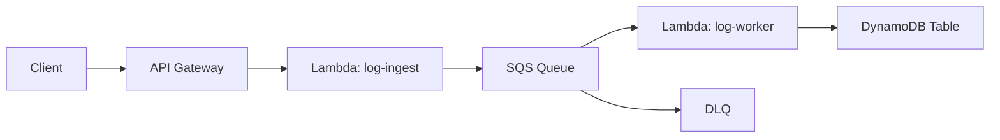

# Unified Ingestion pipeline via Rust and AWS

This is my implementation for a fully serverless ingestion and processing pipleine built with AWS Lambda, SQS, and DynamoDB. At a high level, this pipeline normalizes incoming logs from multiple formats (plaintext / JSON), simulates removing important user data, and inputs structured data in DynamoDB.

## Quick Start

To build this project, you need to have the following prerequisites:
- [AWS CLI](https://docs.aws.amazon.com/cli/latest/userguide/getting-started-install.html)
- [Rust toolchain](https://rust-lang.org/tools/install/)
- Python 3.x + requests (for test simulation script) (OPTIONAL)

Additionally, the pipeline requires 3 AWS permissions:
- `lambda:*` (for create/update functions)
- `sqs:*` (create queue, send/recieve)
- `dynamodb:*` (create table, put/get item)

## Deployment instructions

#### For a local build:
```bash
cargo lambda build --release --package ingest --output-format zip
cargo lambda build --release --package worker --output-format zip
```

#### Upload & Deployment

For this project, I just uploaded each of the lambda binaries to their respective functions in the AWS console. For a bigger project I would use something like the [AWS CDK](https://aws.amazon.com/cdk/).

## API Documentation

The only endpoint needed for this project was `/ingest`. Below, I will give some sample json and plaintext inputs that I used to test the endpoints

#### JSON:
```bash
curl -X POST https://<api-id>.execute-api.us-east-1.amazonaws.com/prod/ingest \
  -H "Content-Type: application/json" \
  -d '{
        "tenant_id": "tenant-1",
        "log_id": "uuid-1234",
        "text": "Customer 555-123-4567 logged in"
      }'
```

#### Plaintext:
```bash
curl -X POST https://<api-id>.execute-api.us-east-1.amazonaws.com/prod/ingest \
  -H "Content-Type: text/plain" \
  -H "x-tenant-id: tenant-1" \
  -d "Raw log text here"
```

#### Response:
- If the request has a valid body / structure, then we recieve a `202 accepted` response.
- If the request is invalid, we try to propogate the error to the user, or just respond with `internal server error`.

## DynamoDB Schema
This part of the project took the most reserch and trial and error. Initially, I didn't know what tenant isolation actually meant, so I did some [research](https://aws.amazon.com/solutions/guidance/multi-tenant-architectures-on-aws/) and came up with this:

| Attribute | Type | Role |
| :--- | :------ | :---- |
| `tenant_id` | String       | Partition Key that identifies the tenant that owns this log|
| `log_id` | String        | Sort key (unique per log for a given tenant)|
| `original_text` | String       | Raw log text when initially ingested|
| `modified_text` | String| Processed / Redacted text |
| `processed_at` | String (ISO timestamp) | Timestamp when processing completed |

My design uses a single DynamoDB table shared by all tenants, with data partiotined by the `tenant_id.` This is the "pool/shared table" approach from the AWS guidance article.

In this model, each row includes a tenant identifier (`tenant_id`), which prevents any accidental cross-tenant data mixing. I chose this model because it was the most operationally simple. We don't use per-tenant tables, and we don't need to manage multiple databases, so this solution becomes the most cost effective.

One of the drawbacks / flaws with this design is that every query **must explicitly filter by tenant_id** to maintain logical isolation between tenants. Although all data resides in the same DynamoDB table, DynamoDB physically partitions rows by the partition key, so querying with a specific tenant_id only accesses that tenant’s data. 

#### Scalability & Simplicity

Using a single, pooled DynamoDB table keeps operations simpler, ( backups, permissions, indexing), and scales horizontally without needing to provide per-tenant database resources. Additionally, this design fits well with serverless patterns (Lambda + SQS + DynamoDB). DynamoDB also auto-scales storage and throughput, so we don't need to pre-provision capacities per tenant.


## Testing

I tested this project in a very simple way. For the ingestion side, I had claude write me a python script that I could use to send `n` amount of logs to the endpoint.

For the database side, I wrote a bash script that basically just queried the db based on a tenant-id.

#### Usage

Simulate hitting the endpoint:
```bash
python simulate_logs.py 50
```

Check the database entries:
```bash
./scripts/test_isolation.sh
```

You could also just scan the entire db (not query) via:
```bash
aws dynamodb scan --table-name tenant_processed_logs
```

## Summary

The core architecture flow at a high level is as follows:



#### Future improvements:

If I were to extend this project beyond this scope, I’d focus mainly on scaling and observability. The first thing I'd do would be configuring batching writes in the worker Lambda to reduce DynamoDB costs and improve throughput. Additionally, for higher-volume ingestion and faster processing, id migrate to EventBridge or Kinesis. I’d also build a simple dashboard (CloudWatch + Grafana) to visualize ingestion rates, and tenant activity. Finally, I’d add API key authentication to /ingest for more secure access for tenants.
